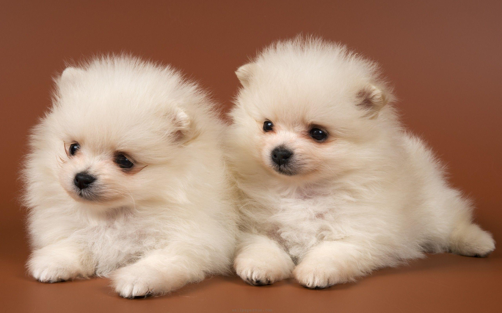

# PUPPIES
<!DOCTYPE html>
<html lang="en">
<head>
    <meta charset="UTF-8">
    <meta name="viewport" content="width=device-width, initial-scale=1.0">
    <title>My Stylish Website</title>
    <link rel="stylesheet" href="styles.css">
</head>
<body>
    <header>
        <nav>
            <uL>
                <li><a href="gallery.html" class="active">Gallery</a></li>
                <li><a href="#">About</a></li>
                <li><a href="#">Services</a></li>
                <li><a href="#">Contact</a></li>
            </ul>
        </nav>
    </header>
    <section id="Home">
        <h1>Welcome to My Stylish Website</h1>
        

            
            
            
        

        
This is the home section.Enjoy the image slider and explore

    </section>
    <section id="About">
        <h2>About Us</h2>
        
This is the about section

    </section>
    <section id="Services">
        <h2>Our Services</h2>
        
Details about services offered

    </section>
    <section id="Gallery">
        <h2>Gallery</h2>
        
Check out our gallery of images and videos

        
    </section>
    <section id="contact">
        <h2>Contact us</h2>
        
This is the contact section

    </section>
    <footer>
        
&copy; 2024 is my stylish Website

    </footer>
</body>
</html>

<!DOCTYPE html>
<html lang="en">
<head>
    <meta charset="UTF-8">
    <meta name="viewport" content="width=device-width, initial-scale=1.0">
    <title>Document</title>
    <link rel="stylesheet" href="styles.css">
</head>
<body>
   <header>
     <nav>
        <ul>
            <li><a href="home.html" class="active">Home</a></li>
            <li><a href="gallery.html" class="active">Gallery</a></li>
            <li><a href="#">About</a></li>
            <li><a href="#">Services</a></li>
            <li><a href="#">Contact</a></li>
        </ul>
     </nav>
   </header> 
   <section id="gallery">
    <h1>Our Gallery</h1>
    

        
        
        
    

   </section>
</body>
</html>

<!DOCTYPE html>
<html lang="en">
<head>
    <meta charset="UTF-8">
    <meta name="viewport" content="width=device-width, initial-scale=1.0">
    <title>My Stylish Website</title>
    <link rel="stylesheet" href="styles.css">
</head>
<body>
    <header>
        <nav>
            <uL>
                <li><a href="home.html" class="active">Home</a></li>
                <li><a href="gallery" class="active">Gallery</a></li>
                <li><a href="#">About</a></li>
                <li><a href="#">Services</a></li>
                <li><a href="#">Contact</a></li>
            </ul>
        </nav>
    </header>
    <section id="Home">
        <h1>Welcome to My Stylish Website</h1>
        

            
            
            
        

        
This is the home section.Enjoy the image slider and explore

    </section>
    <section id="About">
        <h2>About Us</h2>
        
This is the about section

    </section>
    <section id="Services">
        <h2>Our Services</h2>
        
Details about services offered

    </section>
    <section id="Gallery">
        <h2>Gallery</h2>
        
Check out our gallery of images and videos

        
    </section>
    <section id="contact">
        <h2>Contact us</h2>
        
This is the contact section

    </section>
    <footer>
        
&copy; 2024 is my stylish Website

    </footer>
</body>
</html>

 body {
    font-family: Arial, sans-serif; 
    margin: 0; 
    padding: 0;
    background-color: blue; 
    color: #333;
}

header {
    background-color: #333;
    padding: 15px 0; 
    text-align: center; 
}

nav ul { 
    list-style: none;
    padding: 0;
    margin: 0; 
}

nav ul li {  
    display: inline; 
    margin: 0 15px; 
}

nav ul li a { 
    color: white;
    text-decoration:none; 
    font-size: 18px; 
}

nav ul li a.active, 
nav ul li a:hover { 
    color: #f4b400; 
    font-weight: bold; 
}
 section { 
    padding: 40px; 
    text-align: center; 
    background-color: white; 
    margin: 20px; 
    border-radius: 10px;
    box-shadow: 0px 0px 10px rgba(0, 0, 0, 0.1);
}

.slider {
    width: 100%;
    max-width: 600px;
    overflow: hidden; 
    position: relative;
    margin: auto;
}

.slider img {
    width: 100%;
    display: block; 
    position: absolute;
    opacity: 0; 
    animation: slide 12s infinite;
}

.slider img:nth-child(1) { 
    animation-delay: 0s;
} 
.slider img:nth-child(2) {
    animation-delay: 4s;
} 
.slider img:nth-child(3) {
    animation-delay: 8s; 
}

@keyframes slide { 
    0% { opacity: 0; }
    10% { opacity: 1; }
    30% { opacity: 1; } 
    40% { opacity: 0; }
    100% { opacity: 0; }
}

.gallery-container {
     display: flex; 
     flex-wrap: wrap;
     justify-content: center; gap: 10px;
}

.gallery-container img { 
    width: 200px; 
    height: auto; 
    border-radius: 5px; 
    transition: transform 0.3s;
}

.gallery-container img:hover { 
    transform: scale(1.1); 
}

footer { 
    background-color: #333; 
    color: white; 
    text-align: center;
    padding: 10px; 
    position: relative; 
    bottom: 0;
    width: 100%;
}
